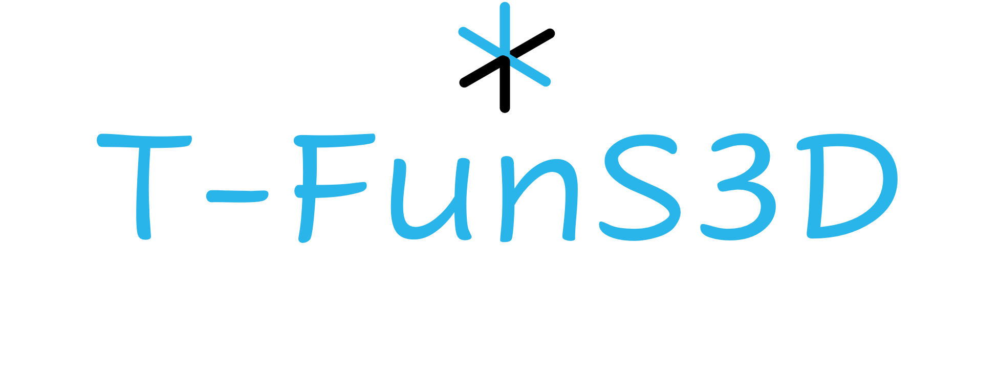

<p align="center">
  
</p>
<p align="center">
  <a href="https://arxiv.org/abs/2606.05975v1"></a>
  <a href="https://t-funs3d.github.io/"></a>
</p>

# T-FunS3D: Task-Driven Hierarchical Open-Vocabulary 3D Functionality Segmentation

**[ICRA 2026]** The repository contains the official implementation of [T-FunS3D](https://t-funs3d.github.io/). **T-FunS3D** constructs an open-vocabulary scene graph using 3D point cloud and posed RGB-D images of an indoor environment. Once a free-form task query is assigned, **T-FunS3D** segments the functional interactive object parts in the 3D point cloud.


> **T-FunS3D: Task-Driven Hierarchical Open-Vocabulary 3D Functionality Segmentation**<br> 
> [Jingkun Feng](), [Reza Sabzevari]() <br> 
> ICRA 2026

**[[Paper](https://arxiv.org/abs/2606.05975v1)] [[Project Page](https://t-funs3d.github.io/)]**


## Requirements

- **Python**: 3.10
- **PyTorch**: 2.1+ with CUDA 12.1+
- **GPU**: NVIDIA GPU with ≥16GB VRAM.

## Installation

```bash
# Clone the repository
git clone --recursive https://github.com/EdwardjkFeng/T-FunS3D.git
cd T-FunS3D

# Automated setup (run from the repository root)
bash install.sh

# Run the commands in the script one by one in case automatic setup fails.
# Check the alternatives provided in the script.

# Download checkpoints and example data (also from the repository root)
bash download_data.sh
```

<!-- See [docs/INSTALL.md](docs/INSTALL.md) for manual installation and docker usage. -->

<!-- ## Demo

Run scene graph construction and functionality segmentation on an example scene.

```bash
conda activate t-funs3d

# Open-vocabulary instance segemnetation
bash run_openmask3d_single_scene.sh

# Scene graph construction
bash run_scene_graph_construction.sh

# Task queries parser
bash run_task_parser.sh

# Functionality segmentation
bash run_functionality_segmentation.sh
```

Outputs are saved to 'demo/outputs/example_scene/' -->

## Run Evaluation on SceneFun3D
Before running this script, adjust the folowings: 
1. `ROOT`: dataset root
2. `OUTPUT_DIRECTORY`, `OUTPUT_FOLDER_DIRECTORY`: output paths

```bash
bash run_t-funs3d.sh
```


## BibTeX

If you find T-FunS3D useful for your research and applications, please cite us using this BibTex:

```bibtex
@inproceedings{feng2026tfuns3d,
  author    = {Feng, Jingkun and Sabzevari, Reza},
  title     = {T-FunS3D: Task-Driven Hierarchical Open-Vocabulary 3D Functionality Segmentation},
  booktitle = {2026 IEEE International Conference on Robotics and Automation (ICRA)},
  year      = {2026}
}
```

## License

This project is licensed under the MIT License. See [LICENSE](LICENSE) for full terms. Code from Third-party (e.g., [OpenMask3D](https://github.com/OpenMask3D/openmask3d), [SceneFun3D]()) retains its original license.

## Acknowledgements
We build on prior advances in open-vocabulary 3D segementation, foundation models, and vision-language models. Our codebase utilizes code from [OpenMask3D]((https://github.com/OpenMask3D/openmask3d)), [Fun3DU](https://github.com/tev-fbk/fun3du), [FG-CLIP](https://huggingface.co/qihoo360/fg-clip-base), [QWen3](https://huggingface.co/Qwen/Qwen3-4B-Instruct-2507), and [Molmo](https://github.com/allenai/molmo). We sincerely appreciate the authors for their wonderful work and for releasing their code, models, and data processing scripts.